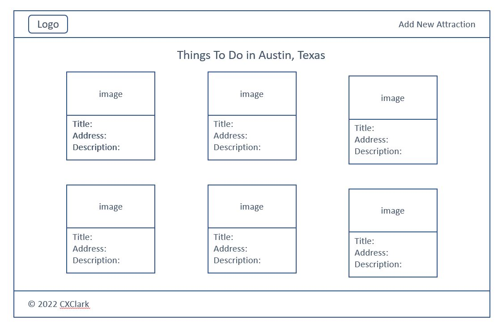

## Austin Attractions CRUD App with Google Login
The purpose of this project was to build a full-stack CRUD (Create, Read, Update,Delete) application using Node.js, Express, EJS, and Mongoose. Since I recently moved to Austin, TX, I used this opportunity to build an application around Austin attractions and things to do in the area.

In my app, users can:

1. View all attractions
1. See details of a single attraction
1. Edit details of an attraction
1. Delete an attraction
1. Add an attraction
1. Login with Google
1. Logout
1. Add reviews (comments + ratings) for an attraction

The app can be accessed here: [austin-attractions.herokuapp.com](https://austin-attractions.herokuapp.com/).

### Technologies
* Cloudinary
* Express
* EJS
* Heroku
* JavaScript
* MongoDB Atlas
* Mongoose
* Multer
* Node.js
* OAuth

### User Stories
- User can visit the website and view Austin attractions.
- User can click through and see attraction details and comments from other visitors.
- User can create new Austin attractions and add to the list of Austin attractions.
- User can edit and delete existing Austin attractions.
- User can upload and view photos associated with attractions.
- User can login using Google.

### Original Wireframes

### Unsolved Problems/Next Steps
1. Build in logic so that only logged in users can add commments.
1. Resolve issue with editing images for attractions.
1. Remove extra spacing in description when going to edit an attraction.
1. Add [`passport-local`](https://www.passportjs.org/packages/passport-local/) to my `passport.js` to give users the option to login locally.
1. Add [`bcrypt`](https://www.npmjs.com/package/bcrypt) for password encryption.
1. Add login options for Facebook and Twitter.
1. Add ability to favorite attractions.
