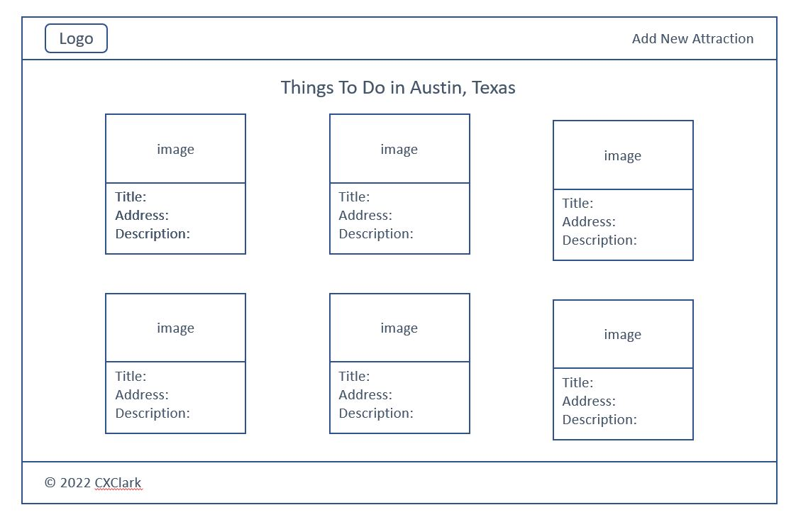
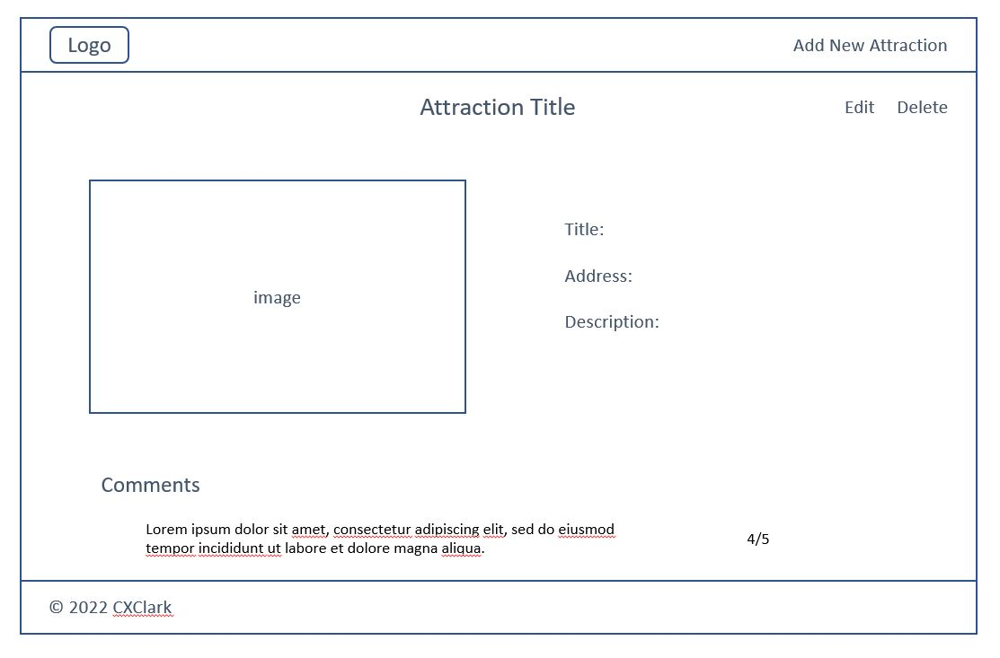

### Your project idea 
#### Austin Attractions
Having just moved to Austin, TX, I want to build an app that lists the top attractions and things to do here. Each attraction will have a photo you can click on, which will take you to a detail page describing that attraction, along with comments from users. 

### MVP
- User can visit the website and view Austin attractions
- User can click through and see attraction details and comments from other visitors
- User can create new Austin attractions and add to the list of Austin attractions

### Stretch Goals
- User can login using Google, Facebook, Twitter
- User can favorite attractions
- Use Multer to upload photos

### Front-end
- Planning to use EJS

### List of Mongoose models and their properties
- AttractionSchema: {
    title: String,
    address: String,
    description: String,
    image: Buffer(?)
    comments: [CommentSchema]
}

- CommentSchema: {
    content: String,
    rating: type: number, min, max
}

### List of Routes
Attraction routes:
- Index: /attractions (GET: display all attractions)
- New: /attractions/new (GET: renders form to create a new attraction)
- Create: /attractions (POST: make a new attraction)
- Show: /attractions/:id (GET: show details of one attraction)
- Edit: /attractions/:id/edit (GET: render the update page)
- Update: /attractions/:id (PATCH: updates the current attraction)
- Delete: /attractions/:id (DELETE: deletes current attraction)

### User stories
- As a user, I'd like to view all Austin attractions so I can see what there is to do in the area
- As a user, I'd like to view a details page for each attraction so I can see all the information about a given activity
- As a user, I'd like to view comments about each attraction from other visitors so I can prioritize which attractions I'd like to visit
- As a user, I'd like to add and edit attractions so I can build a database of the best things to do in Austin

### Wireframes

